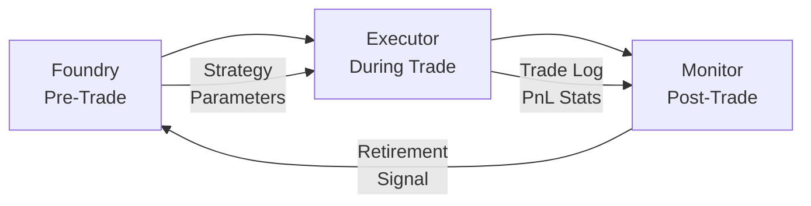

# 🎯 Forward V5 — Mission Control

> **Ziel:** Ein trading-fähiges System das beweist, dass es profitabel arbeitet — nicht nur im Backtest, sondern unter echten Bedingungen.

---

## 📍 Aktueller Stand

**Phase 7 ✅ → Phase 8 ⭐** | Executor V1 gebaut, Paper Trading als nächster Meilenstein

| Phase | Status | Was |
|-------|--------|-----|
| 0–4 | ✅ | Grundstruktur, Core, Observability, Boundaries |
| 5 | ✅ | Operations (systemd, CLI, Health) |
| 6 | ✅ | Test Strategy (24h Stability PASSED) |
| 7 | ✅ | Strategy Lab — Gold Standard gefunden |
| **8** | **⭐ NEXT** | **Paper Trading → Economics** |
| 9 | ⬜ | Final Gate & Live-Freigabe |

---

## 🏆 Gefundene Strategie: MACD Momentum + ADX+EMA

| Metrik | Unfiltered | **ADX+EMA Filter** |
|--------|-----------|---------------------|
| Pass Rate | 12% (2/16) | **50% (8/16)** |
| Avg Return | +53.4% | +35.9% |
| Avg Drawdown | 22.7% | **14.1%** |
| Max Consec. Losses | 9.9 | **6.5** |

**Entry:** `macd_hist > 0 AND close > ema_50 AND ema_50 > ema_200 AND adx_14 > 20`
**Exit:** Trailing Stop 2%, SL 2.5%, Max Hold 48 Bars

Details: [Baseline Strategy](strategy-lab/baseline.md) | Validierung: [ADR-005](architecture/adr-005.md)

---

## 🏗️ Executor V1 — Paper Trading Engine

**Status:** Build complete, Integrationstest bestanden (376 Trades)

| Modul | Status | Beschreibung |
|-------|--------|--------------|
| data_feed | ✅ | Hyperliquid WebSocket, 1h Candles, SQLite Buffer |
| signal_generator | ✅ | Deterministische MACD+ADX+EMA Logik |
| state_manager | ✅ | SQLite State (Position, Equity, Guard) |
| risk_guard | ✅ | 5 Guard States, hardcoded Thresholds |
| paper_engine | ✅ | Orchestrator, Backfill, Slippage, Fees |
| discord_reporter | ✅ | #foundry-reports Channel |
| test_integration | ✅ | 376 Trades auf BTC+ETH 2024 |

**Noch offen:**

- [ ] Embed-Formatierung (farbige Reports)
- [ ] `!kill` / `!resume` Discord Commands
- [ ] systemd Service
- [ ] 30+ Tage Paper Trading Run

Details: [ADR-006](architecture/adr-006.md)

---

## 🛡️ Guard States

```
RUNNING → SOFT_PAUSE → STOP_NEW → KILL_SWITCH → COOLDOWN → RUNNING
  (ok)    (CL≥5)      (daily>5%)  (DD>20%)      (24h)       (!resume)
```

Kill-Switches sind **non-negotiable** und hardcoded.

---

## 📊 Validierung

8 Assets (BTC, ETH, SOL, DOGE, AVAX, LINK, XRP, ADA) × 2 Zeiträume = 16 Tests pro Filter.

| Filter | Pass | Return | DD | CL |
|--------|------|--------|----|----|
| Unfiltered | 12% | +53.4% | 22.7% | 9.9 |
| ADX>20 | 12% | +41.4% | 22.5% | 9.6 |
| ADX>25 | 12% | +33.2% | 22.6% | 10.1 |
| EMA Bull | 25% | +46.9% | 13.6% | 6.6 |
| **ADX+EMA** | **50%** | **+35.9%** | **14.1%** | **6.5** |
| ATR Expansion | 44% | +26.4% | 10.4% | — |
| ATR Tight | 50% | +21.1% | 10.7% | — |

**ATR getestet und abgelehnt** — ADX+EMA bleibt Gold Standard.

---

## 📐 Architecture



- **Foundry:** Backtest, Walk-Forward, Gate Evaluation
- **Executor:** Paper/Live Trading, Risk Guards, Discord Reports
- **Monitor:** Performance Tracking, Strategy Retirement

Details: [ADR-005](architecture/adr-005.md)

---

## 🗺️ Roadmap

### Jetzt — Paper Trading Vorbereitung
1. Discord Embed-Formatierung
2. `!kill` / `!resume` Commands
3. systemd Service für Paper Engine
4. Hyperliquid Testnet Setup

### Nächster Meilenstein — Paper Trading Run
- 30+ Tage auf Hyperliquid Testnet
- ≥30 Trades, ≤25% DD, ≤10pp Win-Rate Deviation
- 95% Signal Execution Rate, ≤60s Kill-Switch Response

### Danach — Phase 8: Economics
- Monthly PnL Projection
- Infra Cost vs. Return
- Break-even Analysis
- Risk-adjusted Returns (Sharpe, Sortino)

### Final — Phase 9: Go/No-Go
- Alle Tests bestanden
- Economics positiv
- Manuelle Freigabe (Dave)

---

## ⚙️ System

| | |
|---|---|
| **Plattform** | Hyperliquid Perps DEX |
| **Startkapital** | 100€, 1x Leverage |
| **Fees** | 0.01% Maker + 1bp Slippage |
| **Gate Thresholds** | 1% Return, PF 1.05, DD≤20%, CL≤8, Sharpe≥0.1 |
| **Discord** | #foundry-reports (automated), DM (interactive) |
| **Repo** | [github.com/dpxyz/pecz](https://github.com/dpxyz/pecz) |