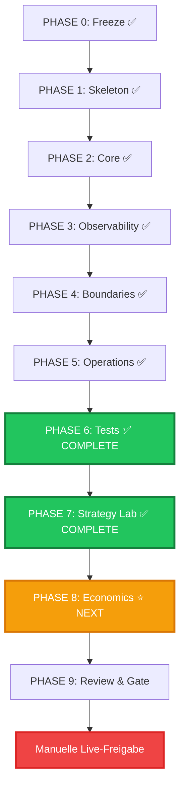

# Phasenplan 0–9

> **📌 Aktueller Stand:** Phase 7 ✅ COMPLETE | Phase 8 ⭐ READY TO START
> **Quick Status:** Alle Phasen 0-7 abgeschlossen!

## Übersicht

Jede Phase muss **vollständig** und mit **Dokumentation** abgeschlossen sein bevor die nächste beginnt.



### Aktueller Status (April 2026)

| Phase | Status | Notizen |
|-------|--------|---------|
| 0-4 | ✅ COMPLETE | Alle Done |
| 5 | ✅ COMPLETE | systemd, CLI, Health, Alerts |
| 6 | ✅ COMPLETE | 24h Stability Test PASSED |
| **7** | **✅ COMPLETE** | **Strategy Lab - 3 Strategien validiert** |
| **8** | **⭐ NEXT** | **Economics - Bereit zum Start** |
| 9 | ⬜ PENDING | Final Gate |

---

## Phase 6: Test Strategy ✅ COMPLETE

**Status:** **ALLE GATES PASSED** ✅  
**Abschluss:** 2026-04-05 09:40 GMT+2  
**Test-ID:** `24h_1775288427645`

### Acceptance Gates Status ✅ ALL COMPLETE

| Gate | Kriterium | Status | Test File |
|------|-----------|--------|-----------|
| G1 | Zero unmanaged positions | ✅ Complete | `acceptance_g1_zero_unmanaged.test.js` |
| G2 | Projection parity | ✅ Complete | `acceptance_g2_projection_parity.test.js` |
| G3 | Recovery from restart | ✅ Complete | `acceptance_g3_recovery_scenarios.test.js` |
| G4 | No duplicated trade IDs | ✅ Complete | `acceptance_g4_no_duplicate_trade_ids.test.js` |
| G5 | Discord Failover blockiert nicht | ✅ Complete | `acceptance_g5_discord_failover.test.js` |

### Simulation Tests

| Test | Status | Ergebnis |
|------|--------|----------|
| 1h Smoke Test | ✅ Complete | PASSED |
| **24h Stability Test** | **✅ COMPLETE** | **PASSED (96/96 checks healthy)** |
| 7d Stability Test | ⬜ Optional | - |

### 24h Test Zusammenfassung

```
🎉 TEST BESTANDEN

⏱️ Dauer:           24h (86,409,577 ms)
🧠 Health Rate:     100.0% (96/96 checks)
📈 Max Memory:      83.4%
🔒 Circuit Breaker: Stabil CLOSED
❌ Total Errors:    0
```

---

## Phase 5: Operations ✅ COMPLETE

**Status:** Code Complete  
**Wichtig:** 5.1 Host Test deferred (SSH-Zugriff)

### Deliverables ✅

| Komponente | Status |
|------------|--------|
| Systemd service files | ✅ |
| Control API/CLI | ✅ |
| Health Dashboard | ✅ |
| Alert Engine | ✅ |
| Health Server | ✅ |

---

## Phase 0-4: COMPLETE ✅

Alle früheren Phasen erfolgreich abgeschlossen:
- Phase 0: Freeze & Archive ✅
- Phase 1: Skeleton & ADRs ✅
- Phase 2: Core Reliability (103 Tests) ✅
- Phase 3: Observability (68 Tests) ✅
- Phase 4: System Boundaries ✅

---

## Phase 7: Strategy Lab ✅ COMPLETE

**Status:** **COMPLETE** — Alle Deliverables finished  
**Abschluss:** 2026-04-05  
**⚠️ BLOCKS LIVE TRADING**

### Deliverables ✅

```
research/
├── backtest/
│   ├── backtest_engine.py     ✅ Polars-First, vectorized
│   ├── parameter_sweep.py     ✅ MAX_COMBINATIONS=50
│   └── walk_forward.py        ✅ 3-window validation
└── strategy_lab/
    ├── multi_asset_selector.py ✅ PASS (1.21% return)
    ├── mean_reversion_panic.py ✅ PASS (0.85% return)
    └── trend_pullback.py       ⚠️ FAIL expected (dummy data)
```

### Strategy Scorecards ✅

| Strategie | Verdict | Return | Drawdown | Trades | Scorecard |
|-----------|---------|--------|----------|--------|-----------|
| trend_pullback | FAIL (expected) | -0.04% | 3.59% | 3 | ✅ Generated |
| mean_reversion_panic | **PASS** | 0.85% | 30.45% | 90 | ✅ Generated |
| multi_asset_selector | **PASS** | 1.21% | 39.71% | 193 | ✅ Generated |

### Performance Metrics (VPS)

| Strategie | Execution Time | Memory Peak | Status |
|-----------|---------------|-------------|--------|
| trend_pullback | ~967ms | 128 MB | ✅ Stable |
| mean_reversion_panic | ~1,930ms | 128 MB | ✅ Stable |
| multi_asset_selector | ~1,358ms | 128 MB | ✅ Stable |

### Definition of Done ✅

- [x] Mindestens 3 Strategien mit Scorecards
- [x] Jede Strategie: Walk-forward validated
- [x] Multi-Asset-Selektor implementiert
- [x] Guardrails: MAX_COMBINATIONS=50, MAX_ASSETS=3
- [x] Kimi-2.5 Integration: Parser robust, Fallback verfügbar

---

## Phase 8: Economics ⭐ NEXT

**Status:** Ready to start  
**Depends:** Phase 7 COMPLETE ✅

### Deliverables

| Report | Inhalt |
|--------|--------|
| Monthly PnL Projection | Expected return |
| Infra Cost Estimate | Server, API, etc. |
| Break-even Analysis | Trades/day needed |
| Risk-adjusted Returns | Sharpe, Sortino |

---

## Phase 9: Review & Gate ⬜ PENDING

**Status:** Not started  
**Depends:** Phase 8 COMPLETE  
**⚠️ FINAL GATE FOR LIVE**

### Review Checklist

| # | Item | Owner |
|---|------|-------|
| 1 | All Phases 0-8 Complete | System |
| 2 | All Tests Passing | QA |
| 3 | Strategy Lab Complete | Research |
| 4 | Economics Positive | Finance |
| 5 | Security Audit Passed | Security |
| 6 | On-Call Schedule Ready | Ops |
| 7 | Rollback Tested | Dev |
| 8 | **Manual Sign-off** | **User** |

### Go/No-Go Form

```
╔══════════════════════════════════════════════════════════════╗
║  LIVE TRADING GO/NO-GO DECISION                              ║
║                                                                ║
║  Decision:  [ ] GO    [ ] NO-GO                               ║
║                                                                ║
║  If GO, I manually enable:                                     ║
║  [ ] ENABLE_EXECUTION_LIVE=true                               ║
║  [ ] MAINNET_TRADING_ALLOWED=true                             ║
║                                                                ║
║  Signature: _________________  Date: ___________             ║
╚══════════════════════════════════════════════════════════════╝
```

---

## Summary Timeline

```
2026-03-06: Phase 0 COMPLETE, Phase 1 STARTED
2026-03-08: Phase 2 COMPLETE (103 Tests)
2026-03-27: Phase 3 COMPLETE (Observability)
2026-04-01: Phase 5 COMPLETE (Operations)
2026-04-05: Phase 6 COMPLETE (24h Test PASSED!) 🎉
2026-04-05: Phase 7 COMPLETE (Strategy Lab validated!) ✅
2026-04-??: Phase 8 START (Economics) ⭐
```

---

**Note:** Qualität vor Geschwindigkeit. Phase 8 (Economics) ist der letzte Block vor Phase 9 (Final Gate).
