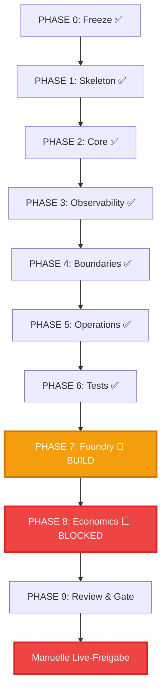

# Phasenplan 0–9

> **📌 Aktueller Stand:** Phase 7 🔨 BUILD — Regime-Filter Validierung | Phase 8 ⬜ BLOCKED
> **Quick Status:** Phasen 0-6 komplett, Foundry V1 Pipeline läuft, ADX+EMA Filter erreicht 50% Pass-Rate
> **🏗️ Architecture:** [ADR-005](architecture/adr-005.md) — Three-Layer (Foundry → Executor → Monitor)

## Übersicht

Jede Phase muss **vollständig** und mit **Dokumentation** abgeschlossen sein bevor die nächste beginnt.



### Aktueller Status (April 2026)

| Phase | Status | Notizen |
|-------|--------|---------|
| 0-4 | ✅ COMPLETE | Alle Done |
| 5 | ✅ COMPLETE | systemd, CLI, Health, Alerts |
| 6 | ✅ COMPLETE | 24h Stability Test PASSED |
| **7** | **🔨 BUILD** | **Foundry V1 Pipeline** |
| **8** | **⬜ BLOCKED** | **Wartet auf Phase 7** |
| 9 | ⬜ PENDING | Final Gate |

---

## Phase 6: Test Strategy ✅ COMPLETE

**Status:** **ALLE GATES PASSED** ✅  
**Abschluss:** 2026-04-05 09:40 GMT+2  
**Test-ID:** `24h_1775288427645`

### Acceptance Gates Status ✅ ALL COMPLETE

| Gate | Kriterium | Status | Test File |
|------|-----------|--------|-----------|
| G1 | Zero unmanaged positions | ✅ Complete | `acceptance_g1_zero_unmanaged.test.js` |
| G2 | Projection parity | ✅ Complete | `acceptance_g2_projection_parity.test.js` |
| G3 | Recovery from restart | ✅ Complete | `acceptance_g3_recovery_scenarios.test.js` |
| G4 | No duplicated trade IDs | ✅ Complete | `acceptance_g4_no_duplicate_trade_ids.test.js` |
| G5 | Discord Failover blockiert nicht | ✅ Complete | `acceptance_g5_discord_failover.test.js` |

### Simulation Tests

| Test | Status | Ergebnis |
|------|--------|----------|
| 1h Smoke Test | ✅ Complete | PASSED |
| **24h Stability Test** | **✅ COMPLETE** | **PASSED (96/96 checks healthy)** |
| 7d Stability Test | ⬜ Optional | - |

### 24h Test Zusammenfassung

```
🎉 TEST BESTANDEN

⏱️ Dauer:           24h (86,409,577 ms)
🧠 Health Rate:     100.0% (96/96 checks)
📈 Max Memory:      83.4%
🔒 Circuit Breaker: Stabil CLOSED
❌ Total Errors:    0
```

---

## Phase 5: Operations ✅ COMPLETE

**Status:** Code Complete  
**Wichtig:** 5.1 Host Test deferred (SSH-Zugriff)

### Deliverables ✅

| Komponente | Status |
|------------|--------|
| Systemd service files | ✅ |
| Control API/CLI | ✅ |
| Health Dashboard | ✅ |
| Alert Engine | ✅ |
| Health Server | ✅ |

---

## Phase 0-4: COMPLETE ✅

Alle früheren Phasen erfolgreich abgeschlossen:
- Phase 0: Freeze & Archive ✅
- Phase 1: Skeleton & ADRs ✅
- Phase 2: Core Reliability (103 Tests) ✅
- Phase 3: Observability (68 Tests) ✅
- Phase 4: System Boundaries ✅

---

## Phase 7: Foundry 🔨 BUILD IN PROGRESS

**Status:** 🔨 BUILD — Foundry V1 Pipeline wird gebaut (2026-04-18)  
**⚠️ BLOCKS PHASE 8 & LIVE TRADING**

### Warum Foundry?

Die 3 Strategien aus v1 FAILen unter realistischen Kriterien:
- Profit Factor alle nahe 1.0 (Ziel: ≥ 1.5)
- Drawdown zu hoch: 30-40% (Ziel: ≤ 15%)
- Return zu niedrig: 0-1.2% (Ziel: ≥ 5%)

### OpenClaw Foundry — 10 Prinzipien

1. KI entwirft Strategien, bewertet aber nie selbst
2. Binäre Verdicts: PASS oder FAIL
3. FAIL = verworfen, nicht gerettet
4. PASS → promoted zu Paper/Shadow Trading
5. Nutzerprodukt = 1 Discord-Nachricht pro Woche
6. Innovation durch Spec + Gates, nicht mehr KI
7. Spec ist Wahrheit
8. Versionierte Audit-Trails
9. Trennung von Generierung und Bewertung
10. Strategy Factory, keine Spielwiese

### Foundry V1 Pipeline

```
spec.yaml (Wahrheit)
    ↓
generator.py → Gemma4:31b → 3 Kandidaten als DSL-JSON
    ↓
strategy_dsl.py → Syntax-Validierung
    ↓
dsl_translator.py → DSL-JSON → strategy_func(df, params)
    ↓
backtest_engine.py → Polars-Backtest mit Fees/Slippage
    ↓
walk_forward.py → Walk-Forward Analysis (3 Windows)
    ↓
gate_evaluator.py → 5 harte Gates, binär PASS/FAIL
    ↓
Discord: "1 BACKTEST_PASS, 2 FAIL"
```

### Pipeline-Dateien (V1)

| Datei | Funktion | Status |
|-------|----------|--------|
| `spec.yaml` | Spezifikation (Wahrheit) | ✅ Aktualisiert |
| `strategy_dsl.py` | DSL-Definition + Validierung | ✅ Vorhanden |
| `generator.py` | Gemma4-Generator | ✅ Vorhanden |
| `dsl_translator.py` | DSL-JSON → strategy_func | ✅ **NEU gebaut** |
| `backtest_engine.py` | Polars-Backtest | ✅ Vorhanden |
| `walk_forward.py` | Walk-Forward Analysis | ✅ Vorhanden |
| `gate_evaluator.py` | 5 Gates, binäre Verdicts | ✅ Vorhanden |
| `evolution_runner.py` | Orchestrierung v2.0 | ✅ **NEU gebaut** |

### Definition of Done

- [x] Foundry-Script bauen (dsl_translator + evolution_runner v2.0)
- [x] Echter Backtest-Runner integriert (WalkForward + Gate Evaluator)
- [x] Datenpfad verifiziert (8 Assets, je ~20K hourly candles)
- [x] Erster Foundry-Run (MACD Momentum + Regime-Filter)
- [x] Breite Validierung (6 Strategien × 3 Assets × 5 Perioden = 90 Tests)
- [x] Regime-Filter Validierung (5 Varianten × 8 Assets × 2 Perioden = 80 Tests)
- [x] Bug-Fixes: ADX (Expression API), _IND_PATTERN (ADX + bb_width)
- [ ] ≥60% Pass-Rate mit optimiertem Regime-Filter
- [ ] Paper/Shadow-Trading auf Hyperliquid Testnet
- [ ] Wöchentlicher Cron + Discord-Report
- [ ] ADR-005 Layer-Interfaces finalisiert

### Current Best Strategy: MACD Momentum + ADX+EMA

**Entry:** `macd_hist > 0 AND close > ema_50 AND ema_50 > ema_200 AND adx_14 > 20`
**Exit:** trailing_stop 2%, stop_loss 2.5%, max_hold 48 bars

| Metric | Unfiltered | ADX+EMA Filter |
|--------|-----------|----------------|
| Pass Rate | 12% (2/16) | **50% (8/16)** |
| Avg DD | 22.7% | **14.1%** |
| Avg CL | 9.9 | **6.5** |
| Avg Return | +53.4% | +35.9% |

**ETH 2025Q1: -16.4% → +4.0%** (Regime-Filter avoids bear market)

### Alte Strategien (v1, archiviert)

| Strategie | Verdict v1 | Verdict v2 (Gates) | Grund |
|-----------|-----------|-------------------|-------|
| trend_pullback | FAIL | FAIL | -0.04% Return, 3 Trades |
| mean_reversion_panic | PASS | FAIL | PF 1.007, DD 30.45% |
| multi_asset_selector | PASS | FAIL | DD 39.71%, Return 1.21% |

---

## Phase 8: Economics + Executor Setup ⬜ BLOCKED

**Status:** Blocked by Phase 7 (≥60% Pass-Rate)  
**Depends:** Phase 7 Foundry ≥60% Pass-Rate + Paper Trading

### Deliverables

| Report | Inhalt |
|--------|--------|
| Monthly PnL Projection | Expected return |
| Infra Cost Estimate | Server, API, etc. |
| Break-even Analysis | Trades/day needed |
| Risk-adjusted Returns | Sharpe, Sortino |

### Executor V1 (Layer 2) — Nach Phase 7

| Komponente | Beschreibung |
|-----------|-------------|
| Hyperliquid SDK | Order execution, position tracking |
| Kill-Switches | Daily-loss 5%, max DD 20%, 1 position max |
| Position Sizing | 2% per trade, Kelly 1/4 |
| Deterministic Rules | Kein LLM during trading |
| Discord Alerts | Trade entries/exits, kill-switch activations |

---

## Phase 9: Review & Gate ⬜ PENDING

**Status:** Not started  
**Depends:** Phase 8 COMPLETE  
**⚠️ FINAL GATE FOR LIVE**

### Review Checklist

| # | Item | Owner |
|---|------|-------|
| 1 | All Phases 0-8 Complete | System |
| 2 | All Tests Passing | QA |
| 3 | Strategy Lab Complete | Research |
| 4 | Economics Positive | Finance |
| 5 | Security Audit Passed | Security |
| 6 | On-Call Schedule Ready | Ops |
| 7 | Rollback Tested | Dev |
| 8 | **Manual Sign-off** | **User** |

### Go/No-Go Form

```
╔══════════════════════════════════════════════════════════════╗
║  LIVE TRADING GO/NO-GO DECISION                              ║
║                                                                ║
║  Decision:  [ ] GO    [ ] NO-GO                               ║
║                                                                ║
║  If GO, I manually enable:                                     ║
║  [ ] ENABLE_EXECUTION_LIVE=true                               ║
║  [ ] MAINNET_TRADING_ALLOWED=true                             ║
║                                                                ║
║  Signature: _________________  Date: ___________             ║
╚══════════════════════════════════════════════════════════════╝
```

---

## Summary Timeline

```
2026-03-06: Phase 0 COMPLETE, Phase 1 STARTED
2026-03-08: Phase 2 COMPLETE (103 Tests)
2026-03-27: Phase 3 COMPLETE (Observability)
2026-04-01: Phase 5 COMPLETE (Operations)
2026-04-05: Phase 6 COMPLETE (24h Test PASSED!) 🎉
2026-04-05: Phase 7 v1 COMPLETE (Strategy Lab validated)
2026-04-18: Phase 7 RE-OPENED → Foundry-Redesign beschlossen
2026-04-19: Phase 7 BUILD — Regime-Filter Validation (50% Pass-Rate)
2026-04-19: ADR-005 — Three-Layer Architecture (Foundry → Executor → Monitor)
```

---

**Note:** Qualität vor Geschwindigkeit. Phase 8 (Economics) ist der letzte Block vor Phase 9 (Final Gate).