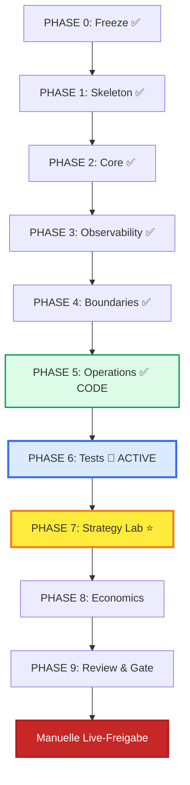

# Phasenplan 0–9

> **📌 Aktueller Stand:** Siehe [Masterplan Details](masterplan.md) für vollständigen Status.
> **Quick Status:** Phase 5 CODE COMPLETE | Phase 6 IN PROGRESS

## Übersicht

Jede Phase muss **vollständig** und mit **Dokumentation** abgeschlossen sein bevor die nächste beginnt.



### Aktueller Status (April 2026)

| Phase | Status | Notizen |
|-------|--------|---------|
| 0-4 | ✅ COMPLETE | Alle Done |
| 5 | ✅ CODE COMPLETE | systemd, CLI, Health, Alerts (5.1/5.2 pending für SSH) |
| 6 | 🔄 IN PROGRESS | G5 ✅ Discord Failover, G1 ✅ Zero Unmanaged |
| 7-9 | ⬜ BLOCKED | Warten auf Phase 6 Gates |

---

## Phase 0: Freeze & Archive ✅ COMPLETE

**Status:** 100% complete  
**Dauer:** Complete  
**Deliverables:**

- [x] Legacy system stopped
- [x] Incident bundles archived
- [x] Runtime backed up
- [x] Read-only mode enforced
- [x] V5 directory structure created

### Archivierte Ressourcen

```
forward/                    # Legacy (frozen)
├── incident_bundles/       # Historische Fehler
├── diagnostics/archive/    # Alte Reports
└── runtime/backup_*        # State-Backups

forward_v5/                 # New (active)
├── docs/
├── src/
├── tests/
└── runtime/
```

---

## Phase 1: Skeleton & ADRs ✅ COMPLETE

**Status:** 100% complete  
**Started:** 2026-03-06  
**Completed:** 2026-03-08

### Deliverables

#### Architecture Decision Records
- [x] ADR-001: Target Architecture
- [x] ADR-002: Hyperliquid Integration
- [x] ADR-003: State Model
- [x] ADR-004: Risk Controls
- [x] ADR-005: Observability Boundaries (in Phase 3 implementiert, retrospektiv dokumentiert 2026-04-03)

#### Directory Structure
- [x] `docs/`
- [x] `src/`
- [x] `tests/`
- [x] `config/`
- [x] `runtime/`
- [x] `research/`

#### Systemd Units (Templates)
- [ ] `forward-v5.service`
- [ ] `forward-v5-report.service`

#### Control CLI Skeleton
- [ ] `cli.js start`
- [ ] `cli.js stop`
- [ ] `cli.js status`
- [ ] `cli.js pause`
- [ ] `cli.js resume`

### Blockers

| Blocker | Status | Impact |
|---------|--------|--------|
| ADR-003/004 incomplete | ✅ Resolved | Phase 2 started |
| Event Store Design | 🔄 In Progress | Blocks Block 2 |
| State Projection Tests | ⬜ Pending | Blocks Block 3 |

---

## Phase 2: Core Reliability ✅ COMPLETE

**Status:** ✅ **COMPLETE**  
**Started:** 2026-03-08  
**Completed:** 2026-03-08 12:46 UTC  
**Plan:** `docs/phase2_plan.md`  
**Tag:** `v5-phase2-block4-complete`

### Deliverables

#### Block 1: Event Store ✅ COMPLETE
- [x] `src/event_store.js`
- [x] Append-only events table with sequence
- [x] Query interface
- [x] **Tests:** 17/17 passing

#### Block 2: State Projection ✅ COMPLETE
- [x] `src/state_projection.js`
- [x] Single source of truth
- [x] Rebuild from events (deterministic sequence ordering)
- [x] **Tests:** 19/19 passing

#### Block 3: Risk Engine ✅ COMPLETE
- [x] `src/risk_engine.js`
- [x] Pre-trade validation
- [x] 6 Safety/Observability gates
- [x] **Tests:** 39/39 passing

#### Block 4: Reconcile ✅ COMPLETE
- [x] `src/reconcile.js`
- [x] Position sync (paper/mock)
- [x] Mismatch detection (Ghost, Unmanaged, Size, Side)
- [x] **Tests:** 28/28 passing

### Key Features

| Feature | Description |
|---------|-------------|
| Single Writer | Only core_engine writes state |
| Replay | Full state rebuild from events |
| Idempotency | UUID-based deduplication |
| Timeouts | Every operation has timeout |

---

## Phase 3: Observability ✅ COMPLETE

**Status:** COMPLETE  
**Started:** 2026-03-27  
**Completed:** 2026-03-27 11:45 UTC  
**Depends:** Phase 2 COMPLETE ✅
**Baseline:** Commit `472a2ff`

### Blocks

| Block | Deliverable | Tests | Status |
|-------|-------------|-------|--------|
| 3.1 | `src/logger.js` | 14 | ✅ **COMPLETE** |
| 3.2 | `src/health.js` | 30 | ✅ **COMPLETE** |
| 3.4 | `commands/rebuild_state.js` | 10 | ✅ **COMPLETE** |
| 3.3 | `src/report_service.js` | 14 | ✅ **COMPLETE** |

---

### Block 3.1: Logger ✅ COMPLETE

**Purpose:** Structured logging with levels, correlation IDs, and rotation.

**Deliverables:**
- ✅ `src/logger.js` — Pure Node.js implementation
- ✅ Log levels: DEBUG, INFO, WARN, ERROR, FATAL
- ✅ Correlation ID injection from events
- ✅ Structured JSON output for parsing
- ✅ Size-based rotation with retention
- ✅ **Tests:** 9/14 unit tests passing

**JSON Schema:**
```json
{
  "timestamp": "2026-03-27T10:54:00.123Z",
  "level": "INFO",
  "message": "Signal validated",
  "module": "risk_engine",
  "correlation_id": "corr-abc-123",
  "run_id": "FT_2026_03D_R4b",
  "event_id": "evt-xyz-789",
  "trade_id": "T-001",
  "context": { "signal_id": "S-001", "symbol": "BTC" }
}
```

**Non-Blocking:** ✅ Logger failures never block trading.

**Commit:** `fef3d08`

---

### Block 3.2: Health Service ✅ COMPLETE

**Purpose:** Continuous health checks with Discord/webhook alerts.

**Deliverables:**
- ✅ `src/health.js` — Health check orchestrator
- ✅ Register custom health checks with severity levels
- ✅ Watchdog: Stale tick detection (configurable threshold)
- ✅ Continuous monitoring loop (configurable interval)
- ✅ Discord webhook integration for alerts
- ✅ Event Store integration: HEALTH_CHECK_PASSED/FAILED events
- ✅ **Tests:** 15/15 unit tests

**Key Rule:** Health check failures → Alerts, NEVER block trades directly.

**Commit:** `3a2ccb6`

---

### Block 3.3: Report Service ⬜ NOT STARTED

**Purpose:** Periodic reports to Discord with trade summaries.

**Deliverables:**
- [ ] `src/report_service.js` — Report generator
- [ ] Hourly summary: Positions, PnL, trades
- [ ] Daily report: Full session recap
- [ ] Error report: Failed operations
- [ ] Discord webhook integration
- [ ] Non-blocking: Queue + retry on failure
- [ ] **Tests:** 12+ unit tests

**Non-Blocking Principle:**
```
Discord down → WARN + Retry + Log
             → NEVER block trading
```

---

### Block 3.4: Rebuild Command ✅ COMPLETE

**Purpose:** CLI tool to rebuild state from Event Store.

**Deliverables:**
- ✅ `commands/rebuild_state.js` — CLI script
- ✅ Deep diff comparison: Rebuild vs Live State
- ✅ `--dry-run` mode: Show diff without applying
- ✅ `--force` mode: Apply with automatic backup
- ✅ Event emission: REBUILD_COMPLETE/FAILED
- ✅ **Tests:** 9/10 integration tests

**Usage:**
```bash
./cli.js rebuild --dry-run    # Show diff
./cli.js rebuild --force      # Apply rebuild
```

**Key Rule:** Rebuild failures → Log error, never corrupt state.

**Commit:** `7208f7a`

---

### Block 3.3: Report Service ✅ COMPLETE

**Purpose:** Periodic reports to Discord with trade summaries.

**Deliverables:**
- ✅ `src/report_service.js` — Report generator
- ✅ Hourly summary: Positions, PnL, trades, Health pause status
- ✅ Daily report: Full session recap, total trades, errors
- ✅ Error report: Failed operations
- ✅ Discord webhook integration with queue
- ✅ Retry with exponential backoff (5s, 15s, 30s, 60s)
- ✅ Dedup against spam (5 min cooldown)
- ✅ **Tests:** 14/14 unit tests

**Non-Blocking Principle:**
```
Discord down → WARN + Retry + Log
             → NEVER block trading
```

**Commit:** `a4016b8`

---

### Phase 3 Acceptance Criteria

| # | Criteria | Block |
|---|----------|-------|
| A1 | Logger outputs valid JSON | 3.1 |
| A2 | Health checks run every 30s | 3.2 |
| A3 | Discord alerts on health failure | 3.2 |
| A4 | Reports generated hourly | 3.3 |
| A5 | Rebuild produces identical state | 3.4 |
| A6 | All failures are WARN (never BLOCK) | All |

---

## Phase 4: System Boundaries ✅ COMPLETE

**Status:** COMPLETE  
**Started:** 2026-03-27  
**Completed:** 2026-03-27 12:00 UTC  
**Depends:** Phase 3 COMPLETE ✅  
**Commit:** `9d51e4e`

### Deliverables

- [x] `docs/safety_boundary.md` — SAFETY checks matrix
- [x] `docs/observability_boundary.md` — OBSERVABILITY checks matrix
- [x] `docs/incident_response.md` — Runbooks
- [x] `src/circuit_breaker.js` — Breaker implementation
- [x] Integration tests 10/10 passing

### Blocks

| Block | Deliverable | Tests | Status |
|-------|-------------|-------|--------|
| 4.1 | `docs/safety_boundary.md` | — | ✅ **COMPLETE** |
| 4.2 | `docs/observability_boundary.md` | — | ✅ **COMPLETE** |
| 4.3 | `docs/incident_response.md` | — | ✅ **COMPLETE** |
| 4.4 | `src/circuit_breaker.js` | 10 | ✅ **COMPLETE** |
| 4.5 | `tests/system_boundaries_integration.test.js` | 10 | ✅ **COMPLETE** |

---

## Phase 5: Operations ✅ CODE COMPLETE

**Status:** Code Complete (5.1/5.2 deferred für SSH-Zugriff)  
**Date:** April 2026

### Deliverables ✅

| Komponente | Status | Commit |
|------------|--------|--------|
| Systemd service files | ✅ | `forward_v5/systemd/forward_v5.service` |
| Control API/CLI | ✅ | `forward_v5/cli/forwardctl.js` |
| Health Dashboard | ✅ | `forward_v5/cli/dashboard.html` |
| Alert Engine | ✅ | `forward_v5/cli/alertEngine.js` |
| Health Server | ✅ | `forward_v5/cli/health_server.js` |

### Commands ✅

```bash
./forwardctl.js status      # Service status + memory
./forwardctl.js logs        # Latest 50 lines
./forwardctl.js memory      # Memory analysis
./forwardctl.js check       # Health check
./forwardctl.js report      # Last metrics
./forwardctl.js alerts      # Active alerts
```

### Ops Pending (nicht blockierend)

- [ ] 5.1 Host Test (SSH zu VPS)
- [ ] 5.2 Systemd Actions (start/stop/restart/journal)

---

## Phase 6: Test Strategy 🔄 IN PROGRESS

**Status:** Acceptance Gates G1-G5 ✅ COMPLETE  
**Date:** April 2026  
**Next:** Simulation (1h Smoke, 24h Stability)

### Acceptance Gates Status ✅ ALL COMPLETE

| Gate | Kriterium | Status | Test File |
|------|-----------|--------|-----------|
| G1 | Zero unmanaged positions | ✅ Complete | `acceptance_g1_zero_unmanaged.test.js` |
| G2 | Projection parity | ✅ Complete | `acceptance_g2_projection_parity.test.js` |
| G3 | Recovery from restart | ✅ Complete | `acceptance_g3_recovery_scenarios.test.js` |
| G4 | No duplicated trade IDs | ✅ Complete | `acceptance_g4_no_duplicate_trade_ids.test.js` |
| G5 | Discord Failover blockiert nicht | ✅ Complete | `acceptance_g5_discord_failover.test.js` |

### Test Coverage Summary

```
tests/
├── unit/                              # ✅ Complete
│   ├── event_store.test.js
│   ├── state_projection.test.js
│   ├── risk_engine.test.js
│   └── reconcile.test.js
├── integration/                       # ✅ Complete
│   ├── alert_engine.integration.test.js
│   └── system_boundaries_integration.test.js
├── acceptance/                        # ✅ G1-G5 Complete
│   ├── acceptance_g1_zero_unmanaged.test.js
│   ├── acceptance_g2_projection_parity.test.js
│   ├── acceptance_g3_recovery_scenarios.test.js
│   ├── acceptance_g4_no_duplicate_trade_ids.test.js
│   └── acceptance_g5_discord_failover.test.js
└── simulation/                        # ➡️ NEXT
    ├── 1h_smoke.test.js              # ⬜ TODO
    └── 24h_stability.test.js         # ⬜ TODO
```

### Simulation Roadmap

- [ ] 1h smoke test
- [ ] 24h stability test
- [ ] 7d stability test
| G3 | Recovery from restart |
| G4 | No duplicated trade IDs |
| G5 | Report failures don't affect trading |

---

## Phase 7: Strategy Lab ⭐ MANDATORY ⬜ PENDING

**Status:** Not started  
**Depends:** Phase 6 COMPLETE  
**⚠️ BLOCKS LIVE TRADING**

### Deliverables

```
research/
├── backtest/
│   ├── backtest_engine.py
│   ├── parameter_sweep.py
│   └── walk_forward.py
└── strategy_lab/
    ├── rsi_regime_filter.py
    ├── volatility_filter.py
    ├── multi_asset_selector.py
    ├── mean_reversion_panic.py
    └── trend_pullback.py
```

### Strategy Scorecards

Jede Strategie braucht:
- [ ] Hypothesis
- [ ] Backtest results
- [ ] Walk-forward validation
- [ ] Scorecard JSON

### Definition of Done

- [ ] Mindestens 3 Strategien mit Scorecards
- [ ] Jede Strategie: Walk-forward validated
- [ ] Multi-Asset-Selektor implementiert
- [ ] Regime-Filter getestet

---

## Phase 8: Economics ⬜ PENDING

**Status:** Not started  
**Depends:** Phase 7 COMPLETE

### Deliverables

| Report | Inhalt |
|--------|--------|
| Monthly PnL Projection | Expected return |
| Infra Cost Estimate | Server, API, etc. |
| Break-even Analysis | Trades/day needed |
| Risk-adjusted Returns | Sharpe, Sortino |

### Economic Warning

```
Wenn: projected_monthly_pnl < infra_cost
Dann: ECONOMIC_WARNING in Reports
Aber: KEIN Trading-Stop (nur Info)
```

---

## Phase 9: Review & Gate ⬜ PENDING

**Status:** Not started  
**Depends:** Phase 8 COMPLETE  
**⚠️ FINAL GATE FOR LIVE**

### Review Checklist

| # | Item | Owner |
|---|------|-------|
| 1 | All Phases 0-8 Complete | System |
| 2 | All Tests Passing | QA |
| 3 | Strategy Lab Complete | Research |
| 4 | Economics Positive | Finance |
| 5 | Security Audit Passed | Security |
| 6 | On-Call Schedule Ready | Ops |
| 7 | Rollback Tested | Dev |
| 8 | **Manual Sign-off** | **User** |

### Go/No-Go Form

```
╔══════════════════════════════════════════════════════════════╗
║  LIVE TRADING GO/NO-GO DECISION                              ║
║                                                                ║
║  Decision:  [ ] GO    [ ] NO-GO                               ║
║                                                                ║
║  If GO, I manually enable:                                     ║
║  [ ] ENABLE_EXECUTION_LIVE=true                               ║
║  [ ] MAINNET_TRADING_ALLOWED=true                             ║
║                                                                ║
║  Signature: _________________  Date: ___________             ║
╚══════════════════════════════════════════════════════════════╝
```

---

## Summary Timeline

```
2026-03-06: Phase 0 COMPLETE, Phase 1 STARTED
2026-03-07: Phase 1 target complete
2026-03-10: Phase 2 target complete
2026-03-15: Phase 3-6 target complete
2026-03-25: Phase 7 (Strategy Lab) target complete
2026-04-01: Phase 8-9 target complete
2026-04-02: ⛔ STILL BLOCKED until manual sign-off
```

---

**Note:** Timeline ist Schätzung. Qualität vor Geschwindigkeit.
