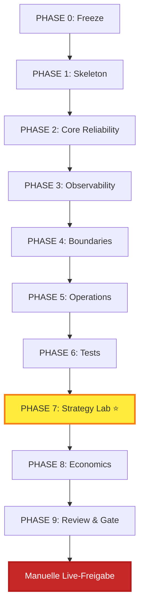

# Phasenplan 0–9

## Übersicht

Jede Phase muss **vollständig** und mit **Dokumentation** abgeschlossen sein bevor die nächste beginnt.



---

## Phase 0: Freeze & Archive ✅ COMPLETE

**Status:** 100% complete  
**Dauer:** Complete  
**Deliverables:**

- [x] Legacy system stopped
- [x] Incident bundles archived
- [x] Runtime backed up
- [x] Read-only mode enforced
- [x] V5 directory structure created

### Archivierte Ressourcen

```
forward/                    # Legacy (frozen)
├── incident_bundles/       # Historische Fehler
├── diagnostics/archive/    # Alte Reports
└── runtime/backup_*        # State-Backups

forward_v5/                 # New (active)
├── docs/
├── src/
├── tests/
└── runtime/
```

---

## Phase 1: Skeleton & ADRs ✅ COMPLETE

**Status:** 100% complete  
**Started:** 2026-03-06  
**Completed:** 2026-03-08

### Deliverables

#### Architecture Decision Records
- [x] ADR-001: Target Architecture
- [x] ADR-002: Hyperliquid Integration
- [x] ADR-003: State Model
- [x] ADR-004: Risk Controls
- [ ] ADR-005: Observability Boundaries (verschoben zu Phase 3)

#### Directory Structure
- [x] `docs/`
- [x] `src/`
- [x] `tests/`
- [x] `config/`
- [x] `runtime/`
- [x] `research/`

#### Systemd Units (Templates)
- [ ] `forward-v5.service`
- [ ] `forward-v5-report.service`

#### Control CLI Skeleton
- [ ] `cli.js start`
- [ ] `cli.js stop`
- [ ] `cli.js status`
- [ ] `cli.js pause`
- [ ] `cli.js resume`

### Blockers

| Blocker | Status | Impact |
|---------|--------|--------|
| ADR-003/004 incomplete | ✅ Resolved | Phase 2 started |
| Event Store Design | 🔄 In Progress | Blocks Block 2 |
| State Projection Tests | ⬜ Pending | Blocks Block 3 |

---

## Phase 2: Core Reliability 🔄 IN PROGRESS

**Status:** ✅ **COMPLETE**  
**Started:** 2026-03-08  
**Completed:** 2026-03-08 12:46 UTC  
**Plan:** `docs/phase2_plan.md`  
**Tag:** `v5-phase2-block4-complete`

### Deliverables

#### Block 1: Event Store ✅ COMPLETE
- [x] `src/event_store.js`
- [x] Append-only events table with sequence
- [x] Query interface
- [x] **Tests:** 17/17 passing

#### Block 2: State Projection ✅ COMPLETE
- [x] `src/state_projection.js`
- [x] Single source of truth
- [x] Rebuild from events (deterministic sequence ordering)
- [x] **Tests:** 19/19 passing

#### Block 3: Risk Engine ✅ COMPLETE
- [x] `src/risk_engine.js`
- [x] Pre-trade validation
- [x] 6 Safety/Observability gates
- [x] **Tests:** 39/39 passing

#### Block 4: Reconcile 🔄 IN PROGRESS
- [ ] `src/reconcile.js`
- [ ] Position sync (paper/mock)
- [ ] Mismatch detection (Ghost, Unmanaged, Size, Side)
- [ ] **Tests:** TBD

### Key Features

| Feature | Description |
|---------|-------------|
| Single Writer | Only core_engine writes state |
| Replay | Full state rebuild from events |
| Idempotency | UUID-based deduplication |
| Timeouts | Every operation has timeout |

---

## Phase 3: Observability 🔄 IN PROGRESS

**Status:** Started  
**Started:** 2026-03-08  
**Depends:** Phase 2 COMPLETE ✅

### Deliverables

- [ ] `src/report_service.js`
- [ ] `src/health.js`
- [ ] `src/logger.js`
- [ ] `commands/rebuild_state.js`

### Non-Blocking Principle

```
Discord down → WARN + Retry + Log
             → NEVER block trading
```

---

## Phase 4: System Boundaries ⬜ PENDING

**Status:** Not started  
**Depends:** Phase 3 COMPLETE

### Deliverables

- [ ] `docs/safety_boundary.md`
- [ ] `docs/observability_boundary.md`
- [ ] `docs/incident_response.md`

### Boundaries Matrix

| Domain | Examples | Fail Mode |
|--------|----------|-----------|
| **SAFETY** | sizing, reconcile, watchdog | **BLOCK** |
| **SAFETY** | leverage, unmanaged | **BLOCK** |
| **OBSERVABILITY** | discord, reports | **WARN** |
| **OBSERVABILITY** | scheduler restart | **RETRY** |

---

## Phase 5: Operations ⬜ PENDING

**Status:** Not started  
**Depends:** Phase 4 COMPLETE

### Deliverables

- [ ] Systemd service files
- [ ] Control API/CLI
- [ ] Log rotation
- [ ] No manual file edits

### Commands

```bash
./cli.js start      # Start service
./cli.js stop       # Stop service  
./cli.js pause      # Pause execution
./cli.js resume     # Resume after review
./cli.js status     # Current status
./cli.js reconcile  # Force reconcile
./cli.js rebuild    # Rebuild from events
```

---

## Phase 6: Test Strategy ⬜ PENDING

**Status:** Not started  
**Depends:** Phase 5 COMPLETE

### Deliverables

#### Unit Tests
- [ ] Event store tests
- [ ] State projection tests
- [ ] Risk engine tests
- [ ] Reconcile tests

#### Integration Tests
- [ ] Tick → Signal → Intent → Fill
- [ ] Discord down → no trading stop
- [ ] Watchdog stale → trading pause
- [ ] Rebuild from store → identical projection

#### Simulation
- [ ] 1h smoke test
- [ ] 24h stability test
- [ ] 7d stability test (after all above)

### Acceptance Gates

| Gate | Kriterium |
|------|-----------|
| G1 | Zero unmanaged positions |
| G2 | Projection parity |
| G3 | Recovery from restart |
| G4 | No duplicated trade IDs |
| G5 | Report failures don't affect trading |

---

## Phase 7: Strategy Lab ⭐ MANDATORY ⬜ PENDING

**Status:** Not started  
**Depends:** Phase 6 COMPLETE  
**⚠️ BLOCKS LIVE TRADING**

### Deliverables

```
research/
├── backtest/
│   ├── backtest_engine.py
│   ├── parameter_sweep.py
│   └── walk_forward.py
└── strategy_lab/
    ├── rsi_regime_filter.py
    ├── volatility_filter.py
    ├── multi_asset_selector.py
    ├── mean_reversion_panic.py
    └── trend_pullback.py
```

### Strategy Scorecards

Jede Strategie braucht:
- [ ] Hypothesis
- [ ] Backtest results
- [ ] Walk-forward validation
- [ ] Scorecard JSON

### Definition of Done

- [ ] Mindestens 3 Strategien mit Scorecards
- [ ] Jede Strategie: Walk-forward validated
- [ ] Multi-Asset-Selektor implementiert
- [ ] Regime-Filter getestet

---

## Phase 8: Economics ⬜ PENDING

**Status:** Not started  
**Depends:** Phase 7 COMPLETE

### Deliverables

| Report | Inhalt |
|--------|--------|
| Monthly PnL Projection | Expected return |
| Infra Cost Estimate | Server, API, etc. |
| Break-even Analysis | Trades/day needed |
| Risk-adjusted Returns | Sharpe, Sortino |

### Economic Warning

```
Wenn: projected_monthly_pnl < infra_cost
Dann: ECONOMIC_WARNING in Reports
Aber: KEIN Trading-Stop (nur Info)
```

---

## Phase 9: Review & Gate ⬜ PENDING

**Status:** Not started  
**Depends:** Phase 8 COMPLETE  
**⚠️ FINAL GATE FOR LIVE**

### Review Checklist

| # | Item | Owner |
|---|------|-------|
| 1 | All Phases 0-8 Complete | System |
| 2 | All Tests Passing | QA |
| 3 | Strategy Lab Complete | Research |
| 4 | Economics Positive | Finance |
| 5 | Security Audit Passed | Security |
| 6 | On-Call Schedule Ready | Ops |
| 7 | Rollback Tested | Dev |
| 8 | **Manual Sign-off** | **User** |

### Go/No-Go Form

```
╔══════════════════════════════════════════════════════════════╗
║  LIVE TRADING GO/NO-GO DECISION                              ║
║                                                                ║
║  Decision:  [ ] GO    [ ] NO-GO                               ║
║                                                                ║
║  If GO, I manually enable:                                     ║
║  [ ] ENABLE_EXECUTION_LIVE=true                               ║
║  [ ] MAINNET_TRADING_ALLOWED=true                             ║
║                                                                ║
║  Signature: _________________  Date: ___________             ║
╚══════════════════════════════════════════════════════════════╝
```

---

## Summary Timeline

```
2026-03-06: Phase 0 COMPLETE, Phase 1 STARTED
2026-03-07: Phase 1 target complete
2026-03-10: Phase 2 target complete
2026-03-15: Phase 3-6 target complete
2026-03-25: Phase 7 (Strategy Lab) target complete
2026-04-01: Phase 8-9 target complete
2026-04-02: ⛔ STILL BLOCKED until manual sign-off
```

---

**Note:** Timeline ist Schätzung. Qualität vor Geschwindigkeit.
